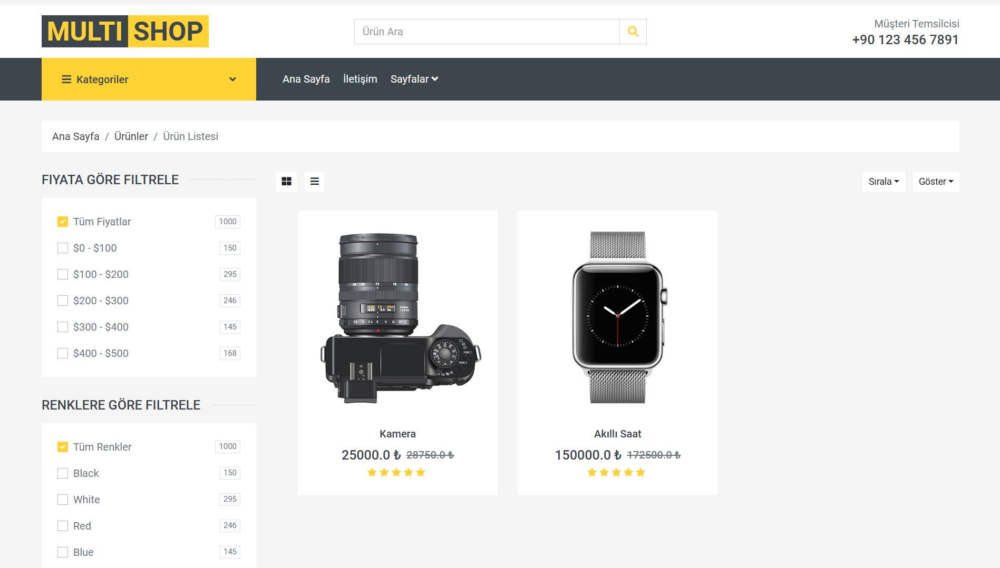

# Proje Detayı
MultiShop, mikroservis mimarisi kullanılarak geliştirilmiş bir projedir ve farklı işlevlere sahip birçok modülü barındırmaktadır. Projede veritabanı yönetimi için MSSQL, MongoDB, Redis, ve PostgreSQL gibi çeşitli teknolojiler tercih edilmiştir. Docker ile konteynerleştirme sağlanmış ve uygulamanın taşınabilirliği artırılmıştır. ORM olarak Entity Framework kullanılarak veritabanı işlemleri yönetilmiştir.

Projenin bazı mikroservislerinde mimari olarak Onion Architecture benimsenmiş, CQRS ve Mediator tasarım desenleri ile veri yönetimi ve iş süreçleri optimize edilmiştir. Kullanıcı kimlik doğrulama ve yetkilendirme süreçleri için Identity Server entegrasyonu gerçekleştirilmiş, API yönetimi ve yönlendirme işlemleri Ocelot üzerinden sağlanmıştır.

## Ekran Görüntüleri

